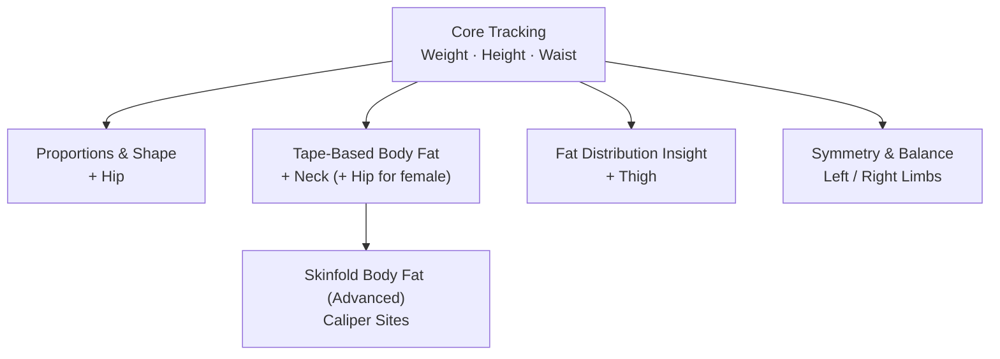

Measurements are not taken in a vacuum.

They are influenced by daily life, human variability, and the way data is collected.

Formetrix is designed with this reality in mind.

This section explains **how to work with measurements pragmatically** — not how to make them perfect.The goal is to reduce unnecessary noise, avoid misinterpretation, and get the most reliable insight from real-world input.

---

## **1. Measure Consistently, Not Perfectly**
  
The goal is not to measure under ideal conditions.

The goal is to measure under **similar conditions each time**.

Try to:

- Measure around the same time of day
    
- Follow a repeatable routine (for example, after waking or before meals)

Small day-to-day variations are normal.

Formetrix is built to place those variations into context — but similar conditions make patterns emerge faster and more clearly.

---
## **2. Focus on What Actually Changes**

You do **not** need to re-measure everything every time.

Some measurements change slowly (such as height or certain circumferences).

Others change more frequently (such as weight or waist).

Formetrix’s **cumulative view** allows you to:

- Update only what has changed
    
- Keep stable values without re-entering them
    
- Maintain a complete and coherent body model over time

This reduces friction, speeds up input, and avoids unnecessary repetition.

---
## **3. Use Realistic Measurement Technique**

For anthropometric measurements:

- Use the same measuring tape
    
- Apply similar tension each time
    
- Measure at the same anatomical landmarks
   
Minor technique differences are expected.

What matters most is repeating **your own method** in a similar way each time.

---

## **4. Expect Short-Term Noise**

Daily fluctuations can come from:

- Hydration
    
- Food intake
    
- Sleep
    
- Stress
    
- Temperature

This is normal.

A single measurement rarely tells the full story.

Meaningful change appears **across multiple measurements**, not from isolated values.

  
> [!info]
> Formetrix reduces the impact of short-term noise by evaluating how **multiple metrics move together over time**, instead of reacting to individual readings in isolation.

---
## **5. Use Body Studio for Context**

Numbers explain _what_ is changing.

Images help you see _how_ it looks.

When using Body Studio:

- Take photos under similar lighting
    
- Use consistent posture and framing (use **Reference Measurement**)
    
- Use auto‑adjustments to match the reference measurement, or manually adjust using the **Photo Kit** included in Body Studio

Visual documentation adds context — not judgment.
For details, see [[body-studio-module]].

---
## **6. Avoid Mixing Too Many External Sources**
  
If you use external devices:

- try to use the same one consistently
    
- avoid mixing results from many different machines unless necessary

Different devices rely on different assumptions and formulas.

Formetrix can absorb that variability — but fewer sources make interpretation clearer.

---
## **7. Interpretation Improves With History**

Formetrix AI adapts **only to your data**.

As your history grows:

- patterns become clearer
    
- interpretations become more reliable
    
- individual noise matters less

There is no shortcut to history — but it compounds over time.

---

## **How to Measure Effectively**

If you want **maximum insight with minimal input**, start with a small, repeatable set.

> [!tip]
>  - The following covers most core indexes and composition estimates with minimal effort
>  - Start with the first group and expand **only when you want more accuracy or depth**.

| **Measurement Group**             | **What You Measure**                     | **Composition & Indexes Available**                                                                     | **Accuracy & Notes**                                                                                                        |
| --------------------------------- | ---------------------------------------- | ------------------------------------------------------------------------------------------------------- | --------------------------------------------------------------------------------------------------------------------------- |
| **Core Tracking**                 | Weight · Height · Waist                  | Body Fat % _(BMI-derived)_ · Lean Body Mass · Fat Mass · Muscle Mass · BMI · BMR · WHtR · ABSI / ABSI-Z | ✓ Enables full composition model   ✓ Excellent for trends   ⚠ Body-fat signal depends on BMI assumptions              |
| **Proportions & Shape**           | + Hip                                    | Waist-to-Hip Ratio                                                                                      | ✓ Adds proportional and health context ✓ No change to body-fat accuracy                                                 |
| **Tape-Based Body Fat**           | + Neck _(+ Hip for female)_              | Body Fat % _(US Navy)_ → refines Lean Mass, Fat Mass, Muscle Mass                                       | ✓ More accurate than BMI-based estimate ✓ Uses direct body dimensions ⚠ Requires consistent tape technique          |
| **Skinfold Body Fat (Advanced)**  | Caliper skinfold sites (JP3 / DW4 / JP7) | Body Fat % _(skinfold-derived)_ → highest-resolution composition                                        | ✓ Potentially most accurate body-fat estimate ⚠ **Highly technique-sensitive** ✕ Poor technique can reduce accuracy |
| **Fat Distribution Insight**      | + Thigh                                  | Visceral Fat Area estimate                                                                              | ✓ Adds regional fat distribution insight ⚠ Sensitive to landmark consistency                                            |
| **Symmetry & Balance (Optional)** | Left & Right arms / legs                 | Arm & Leg Symmetry Indexes                                                                              | ✓ Useful for rehab & performance ✕ Independent of composition accuracy                                                  |

### **How to Read This Table**

- **Body-composition accuracy improves vertically** through the table
	 
	 - **BMI-derived** → fast, trend-oriented
	      
	- **Tape-based** → more anatomically grounded
	     
	- **Skinfold-based** → highest resolution when done correctly
	
- Most users get strong insight from **Core Tracking + Tape-Based Body Fat**
    
- Skinfolds improve accuracy **only when measured correctly**
    
- Later groups add **depth**, not requirement

Formetrix keeps these estimates **comparable over time** instead of overwriting history.

---

### **Start Simple — Then Customize**

The measurement groups above are designed to help you get **maximum insight with minimal input**.
  
For many users, **Core Tracking** combined with **Tape-Based Body Fat** already provides a reliable, interpretable body model with very little friction.

That said, **Formetrix does not stop here**. You are not locked into predefined groups.

You can:

- enable or disable measurement points at any time
    
- create custom pointer sets
    
- track only what matters to your goals

See [[settings]] to manage **measurement pointer presets** and visibility.

---
### **Examples: Using Custom Measurement Focus**

Formetrix allows you to track measurements **independently of presets**, depending on your goals.

  
**Physique / Bodybuilding**

- Track **biceps, forearms, shoulders, chest**, and **thighs** independently
    
- Combine symmetry indexes with visual tracking in **Body Studio**
    
- Focus less on absolute fat % and more on **shape, balance, and progression**

**Health & Lifestyle**

- Focus on **waist, hip, weight**, and **trend-based indexes**
    
- Use cumulative view to reduce repeated input
    
- Prioritize consistency and long-term direction
   

**Rehabilitation / Performance**

- Track **left vs right limb circumferences or lengths**
    
- Monitor symmetry over time
    
- Use visual documentation to support recovery context

> [!Important] You are in control
> Formetrix adapts to **how you track**, not the other way around.

