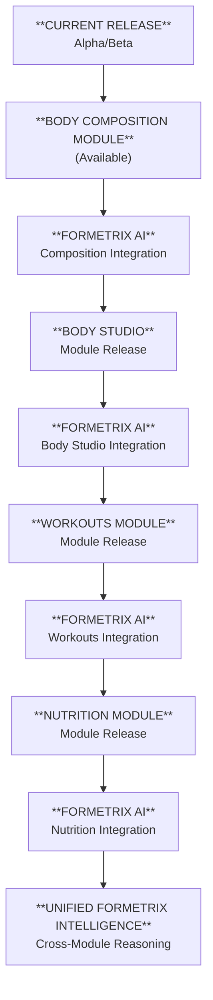

> [!Tip] **Current Status**
> Formetrix is available on **all platforms** (Web, iOS, Android, Desktop) in a **limited Alpha/Beta** phase. At this stage, only the **Body Composition Module** is publicly accessible.
> 
> This phase focuses on validating accuracy, stability, and user experience before expanding into the full Formetrix ecosystem.

## **What’s Available Today**

### **✔ Body Composition Module (Alpha/Beta)**

- Core measurement pipeline
    
- Trend vs Noise analysis
    
    - Graphs
        
    - Composition Indexes & Interpretation Indexes
        
- Multi‑platform access
    
- Continuous UI/UX improvements
    

## **What’s Coming Next**

### **🔜 Formetrix AI — Public Release (Partial Integration)**

The next major milestone introduces the first operational layer of Formetrix AI:

- AI‑powered interpretation of body metrics
    
- Early reasoning engine
    
- First “smart insights” layer
    
- Local‑first models
    
- Local reasoning with data‑aware retrieval (RAG)
    
- Smart import and input (OCR, voice input)
    

This establishes the intelligence layer that future modules will build on.

---

## **Later Milestones**

Every upcoming module ships with its **own Formetrix AI partial integration**, focused on that module’s data and use cases. Formetrix AI is extended and maintained continuously as new modules are released.

### 📸  **Body Studio**

- Shape analysis
    
- Visual progress tracking
    
- Before/after comparisons
    
- **Formetrix AI (Body Studio Integration):**
    
    - Visual change interpretation
        
    - Pattern detection across time
        
    - Contextual insights tied to composition data
    

### **🏋️  Workouts Module**

- In‑app workout tracking
    
- Workout history
    
- Training plans
    
- Exercise library
    
- AI‑generated routines
    
- Progress tracking
    
- **Formetrix AI (Workouts Integration):**
    
    - Training load interpretation
        
    - Recovery and adaptation insights
        
    - Program adjustments based on response
    

### **🍽  Nutrition Module**

- Meal planning
    
- Macro/micro analysis
    
- AI‑generated nutrition guidance
    
- Integration with body composition + workouts
    
- **Formetrix AI (Nutrition Integration):**
    
    - Intake vs progress interpretation
        
    - Habit and pattern detection
        
    - Adaptive nutrition suggestions
        

### **🔗  Unified Formetrix Intelligence**

As each module gains its own AI layer, Formetrix AI gradually operates across all of them, enabling:

- Cross‑module reasoning
    
- Holistic progress interpretation
    
- Coordinated recommendations across composition, training, and nutrition

>

>

