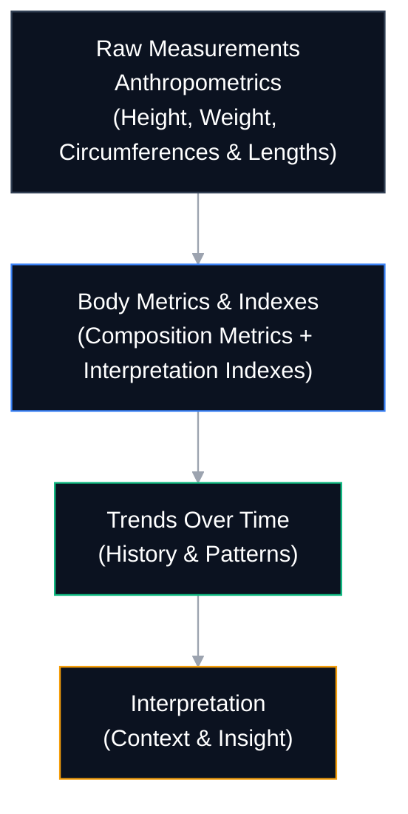

```
---
title: Formetrix Documentation
sidebar: true
graph: true
lastUpdated: true
---
```

## **Welcome to Formetrix**

  

Formetrix is a body composition and progress tracking framework designed to help you understand how your body changes over time — clearly, consistently, and with context.

This documentation explains how Formetrix works, how to use it effectively, and how to interpret the data it provides, whether you are tracking your own progress or reviewing structured data professionally.

```
<!-- Image suggestion: calm overview visual of body + timeline -->
```

---

## **Start here**

  

If you are new to Formetrix, begin with the basics:

- 👉 [[getting-started/index|Getting started]]
    
- 👉 [[getting-started/first-measurement|Your first measurement]]
    
- 👉 [[getting-started/profiles-and-history|Profiles and measurement history]]
    

  

These pages are written to be approachable and require no prior technical or medical knowledge.

---

## **Understand your data**

  

Formetrix focuses on interpretation, not just numbers.

  

To better understand how measurements, estimates, and trends are used:

- 📘 [[concepts/index|Core concepts]]
    
- 📊 [[indexes/index|Body indexes explained]]
    
- 🧠 [[trend-vs-noise]]
    
- 📐 [[measurement-consistency]]
    





## **Modules**

  
Formetrix is organized into modules, each focused on a specific aspect of body analysis and progress tracking.

- 🧩 [[modules/index|Modules overview]]
    
- 🧍 [[modules/body-composition/overview|Body composition module]]

Additional modules are introduced incrementally as they become available.

---

## **About this documentation**

> [!info]
This documentation describes both the design philosophy of Formetrix and the features currently available in the public version.

Some sections outline capabilities that are introduced gradually. Availability may vary by platform and release.


For release-specific information, see "[[guides/release-status|Release status & availability]]".

---

## **Who this documentation is for**
  
This documentation is intended for:

- Individuals tracking their own body composition and long-term progress
    
- Coaches and professionals working with structured body data
    
- Anyone interested in understanding measurement-based body analysis

> [!warning]
Formetrix does not provide medical diagnosis or replace professional medical assessment.


---

**Formetrix™** is a product of **AEV Labs**.  
© AEV Labs. All rights reserved.

- https://aevlabs.com  
- https://formetrix.fit
---

This is a solid **v1 entry point**.

It will age well, and nothing here forces future rewrites.

  

When you’re ready, next we can:

- write getting-started/index.md (short and welcoming), or
    
- draft what-is-formetrix.md using the locked template.
    

  

